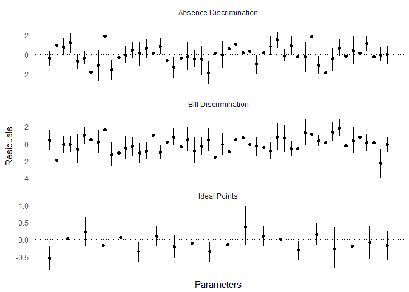
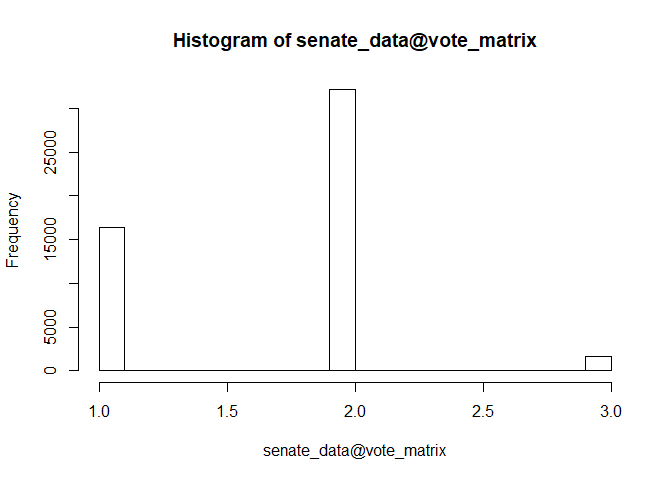
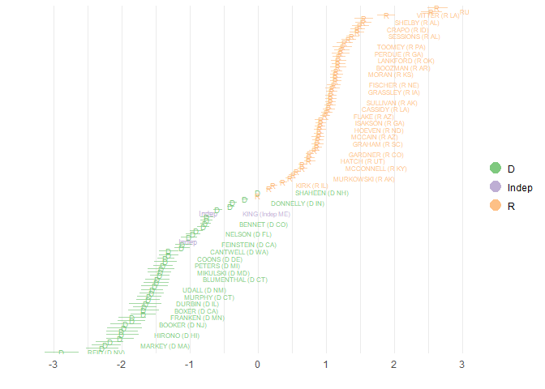
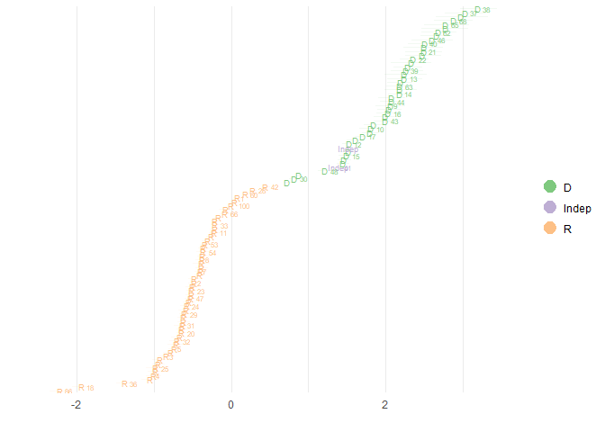

README
================
Robert Kubinec
June 22, 2017

R Package Idealstan (V0.1) README
---------------------------------

This package implements new IRT models (models for absences and for dynamic hiearchical models) along with several standard IRT models (2 PL, rating scale, graded response) designed for modeling rollcall voting data and any other kind of binary or ordinal data. It is based on the Stan package for Bayesian modeling, which includes both MCMC full Bayesian inference and a faster variational Bayesian approximation. The package also has plotting functions for model parameters, particularly the legislator (person) ideal points (ability parameters).

This vignette demonstrates basic usage of the package, which is currently in alpha. A beta release is scheduled for July 13, 2017.

This package takes an approach to modeling legislative roll call data (and other IRT data) that uses a hurdle model to separately account for the probability that a legislator (i.e., test-taker) will show up to vote. This absence-inflated model estimates additional bill (item) parameters to reflect the relative gain or loss a legislator has from showing up to vote. Further details of this model are explained in Kubinec (2017).

To begin with, we can simulate data from an ordinal ideal-point model in which there are three possible responses corresponding to a legislator voting: yes, abstain and no. An additional category is also simulated that indicates whether a legislator shows up to vote or is absent. While traditional ideal point models tend to drop absences, this package can model absences via a hurdle model in which the censoring of the vote/score data is estimated as a function of individual bill intercepts and discrimination parameters for the decision to be absent or present.

``` r
ord_ideal_sim <- id_sim_gen()
knitr::kable(as_data_frame(head(ord_ideal_sim@vote_matrix)))
```

|    1|    2|    3|    4|    5|    6|    7|    8|    9|   10|   11|   12|   13|   14|   15|   16|   17|   18|   19|   20|   21|   22|   23|   24|   25|   26|   27|   28|   29|   30|   31|   32|   33|   34|   35|   36|   37|   38|   39|   40|   41|   42|   43|   44|   45|   46|   47|   48|   49|   50|
|----:|----:|----:|----:|----:|----:|----:|----:|----:|----:|----:|----:|----:|----:|----:|----:|----:|----:|----:|----:|----:|----:|----:|----:|----:|----:|----:|----:|----:|----:|----:|----:|----:|----:|----:|----:|----:|----:|----:|----:|----:|----:|----:|----:|----:|----:|----:|----:|----:|----:|
|    4|    4|    3|    1|    4|    4|    2|    1|    3|    4|    1|    4|    1|    1|    3|    1|    4|    3|    3|    4|    1|    4|    1|    4|    4|    1|    4|    4|    3|    1|    3|    1|    2|    4|    1|    4|    3|    4|    1|    3|    1|    4|    3|    2|    3|    3|    3|    3|    3|    3|
|    4|    4|    3|    1|    4|    2|    3|    4|    3|    4|    4|    4|    4|    1|    4|    1|    3|    3|    2|    1|    1|    4|    4|    4|    3|    3|    4|    4|    1|    1|    3|    1|    1|    4|    1|    4|    3|    4|    4|    3|    1|    4|    3|    3|    2|    3|    2|    3|    3|    3|
|    1|    3|    4|    4|    4|    3|    4|    3|    4|    3|    3|    1|    3|    3|    1|    4|    1|    1|    1|    4|    3|    1|    1|    3|    3|    4|    4|    3|    4|    3|    2|    4|    3|    1|    4|    3|    4|    3|    3|    4|    4|    1|    4|    4|    4|    4|    4|    1|    4|    4|
|    3|    4|    4|    4|    4|    4|    3|    3|    4|    4|    2|    4|    2|    1|    3|    1|    4|    1|    3|    4|    1|    4|    4|    4|    4|    3|    3|    4|    2|    3|    4|    3|    1|    3|    2|    4|    3|    4|    1|    3|    2|    3|    4|    3|    3|    3|    1|    4|    4|    2|
|    1|    3|    4|    3|    1|    3|    4|    1|    4|    3|    3|    3|    3|    3|    1|    4|    1|    1|    4|    4|    4|    3|    3|    3|    3|    4|    3|    3|    4|    4|    4|    4|    4|    3|    3|    3|    4|    3|    4|    4|    4|    1|    4|    4|    4|    4|    4|    4|    4|    4|
|    3|    3|    3|    1|    1|    4|    4|    3|    3|    4|    2|    3|    4|    1|    4|    4|    3|    2|    2|    4|    3|    4|    3|    3|    4|    4|    1|    3|    4|    4|    4|    1|    3|    2|    3|    3|    4|    3|    4|    4|    3|    3|    4|    4|    4|    1|    3|    4|    2|    2|

The vote/score matrix has legislators/persons in the rows and bills/items in the columns. In this simulated data, yes votes are recorded as `3`, no votes as `1`, abstentions as `2`, and absences as `4`.

The function `id_estimate` will take this processed data and run an IRT ideal point model. Currently both inflated and non-inflated versions of the standard binary IRT 2-PL model and the ordinal IRT model (i.e., a rating-scale model) are supported. The package also includes models for hierarchical parameters for legislators/persons and bills/items, along with dynamic IRT models, but these have as yet not been fully tested.

The package has options for identification that are similar to other IRT packages in which the row or column indices of legislators/persons or bills/items to constrain are specified to the `id_estimate` function. For example, we can use the true values of the simulated legislators to constrain two legislators with the highest ideal points and two legislators with the lowest ideal points:

``` r
true_legis <- ord_ideal_sim@simul_data$true_legis
high_leg <- sort(true_legis,decreasing = T,index.return=T)
low_leg <- sort(true_legis,index.return=T)

ord_ideal_est <- id_estimate(idealdata=ord_ideal_sim,
                             model_type=4,
                             fixtype='constrained',
                             restrict_type='constrain_twoway',
                             restrict_ind_high = high_leg$ix[1:2],
                             restrict_ind_low=low_leg$ix[1:2],
                             refresh=500)
```

We can then check and see how well the Stan estimation engine was able to capture the "true" values used in the simulation by looking at the residuals between the estimated and the true values:

``` r
id_plot_sims(ord_ideal_est,type='residual')
```



`legis_resid` are the legislator/person ideal points, `sigma_abs_resid` are the bill/item absence-inflated discrimination parameters, and `sigma_reg_resid` are the bill/item non-inflated discrimination parameters.

Although the model does not do a perfect job of capturing the true values, it is reasonably close for most of the parameters.

The main use of this package is for datasets that are set up in a rollcall voting framework, although any dataset can be used if the responses are binary or ordinal. To show how the package functions empirically, I include in the package the complete voting record of the 114th Senate from the website (www.voteview.com). We can convert this data, which is currently in the form of a `rollcall` object from the `pscl` package, to an `idealdata` object suitable for estimation by using the `id_make` function and specifying which numbers in the vote/score matrix correspond to yes/no votes (or correct/incorrect). We could specify a middle category, `abs_vote`, but we will not do so in this example because this dataset has very few abstentions so there is no reason to add on the extra complexity for just a handful of votes in the dataset.

``` r
data('senate114')
to_use <- senate114$votes
to_use <- apply(to_use, 2, function(x) {
  y <- recode(
    x,
    `1` = 2L,
    `6` = 1L,
    `9` = 3L
  )
  return(y)
})

rownames(to_use) <- rownames(senate114$legis.data)
# Need to drop Obama
senate_data <-
  id_make(
    vote_data = to_use[-1,],
    legis_data = slice(senate114$legis.data,-1),
    abs_vote = 3,
    yes_vote = 2,
    no_vote = 1,
    ordinal = F,
    exclude_level = c(3,7)
  )

hist(senate_data@vote_matrix)
```



The plot shows that there are roughly twice as many yes votes (value of 2) versus no votes (value of 1), with a small minority of absences (value of 3).

We can then run a binary IRT ideal point model in which absences are treated as a "hurdle" that the legislator must overcome in order to show up to vote (this is `model_type=2`). In essence, the model is calculating a separate ideal point position for each bill/item that represents the bill's salience in the ideal point space. Only if a bill is relatively salient will a legislator choose to show up and vote.

Because this dataset is relatively large, we will use the `use_vb` option to use Stan's variational Bayesian inference. This version of the sampler is less accurate and tends to underestimate uncertainty, but it runs much, much faster. I constrain some conservative senators to be positive, and some liberal senators, such as Bernie Sanders, to be negative in order to identify the polarity in the model. I have to pass in the row indices of the constrained legislators to do this. The `seed` argument is passed along to the underlying Stan engine.

``` r
sen_est <- id_estimate(senate_data,
                model_type = 2,
                 use_vb = T,
                 ncores=4,
                 nfix=2,
                 restrict_type='constrain_twoway',
                 restrict_params='legis',
                 restrict_ind_high = c(which(row.names(to_use)=='SASSE (R NE)'),
                                       which(row.names(to_use)=='CRUZ (R TX)'),
                                       which(row.names(to_use)=='RUBIO (R FL)')),
                 restrict_ind_low=c(which(row.names(to_use)=='SANDERS (Indep VT)'),
                                    which(row.names(to_use)=='REID (D NV)'),
                                    which(row.names(to_use)=='WARREN (D MA)')),
                 auto_id=F,
                 fixtype='constrained',
            seed=84520,
            refresh=500)
```

    ## ------------------------------------------------------------
    ## EXPERIMENTAL ALGORITHM:
    ##   This procedure has not been thoroughly tested and may be unstable
    ##   or buggy. The interface is subject to change.
    ## ------------------------------------------------------------
    ## 
    ## 
    ## 
    ## Gradient evaluation took 0.032 seconds
    ## 1000 transitions using 10 leapfrog steps per transition would take 320 seconds.
    ## Adjust your expectations accordingly!
    ## 
    ## 
    ## Begin eta adaptation.
    ## Iteration:   1 / 250 [  0%]  (Adaptation)
    ## Iteration:  50 / 250 [ 20%]  (Adaptation)
    ## Iteration: 100 / 250 [ 40%]  (Adaptation)
    ## Iteration: 150 / 250 [ 60%]  (Adaptation)
    ## Iteration: 200 / 250 [ 80%]  (Adaptation)
    ## Success! Found best value [eta = 1] earlier than expected.
    ## 
    ## Begin stochastic gradient ascent.
    ##   iter       ELBO   delta_ELBO_mean   delta_ELBO_med   notes 
    ##    100    -2e+004             1.000            1.000
    ##    200    -2e+004             0.509            1.000
    ##    300    -2e+004             0.340            0.017
    ##    400    -2e+004             0.256            0.017
    ##    500    -2e+004             0.205            0.004   MEDIAN ELBO CONVERGED
    ## 
    ## Drawing a sample of size 1000 from the approximate posterior... 
    ## COMPLETED.

``` r
id_plot(sen_est,legis_ci_alpha=0.7) + scale_colour_brewer(type='qual')
```



The `id_plot` function has many other options which are documented in the help files. One notable option, though, is to plot bill midpoints along with the legislator ideal points. The midpoints show the line of equiprobability, i.e., at what ideal point is a legislator indifferent to voting on a bill (or answering an item correctly). To plot a bill midpoint overlay, simply include the column index of bill in the response matrix as the `bill_plot` option:

``` r
id_plot(sen_est,legis_ci_alpha=0.7,bill_plot=12) + scale_colour_brewer(type='qual')
```



The 50th bill in the 114 Senate shows very high discrimination: the bill midpoint is right in the middle of the ideal point distribution, with most Democrats voting yes and most Repulicans voting no. The two rug lines at the bottom of the plot show the high density posterior interval for the bill midpoint, and as can be seen, the uncertainty only included those legislators near the very center of the distribution.

Kubinec, Robert. 2017. “Absence Makes the Ideal Points Sharper.” In *2017 Political Methodology Annual Conference*.
